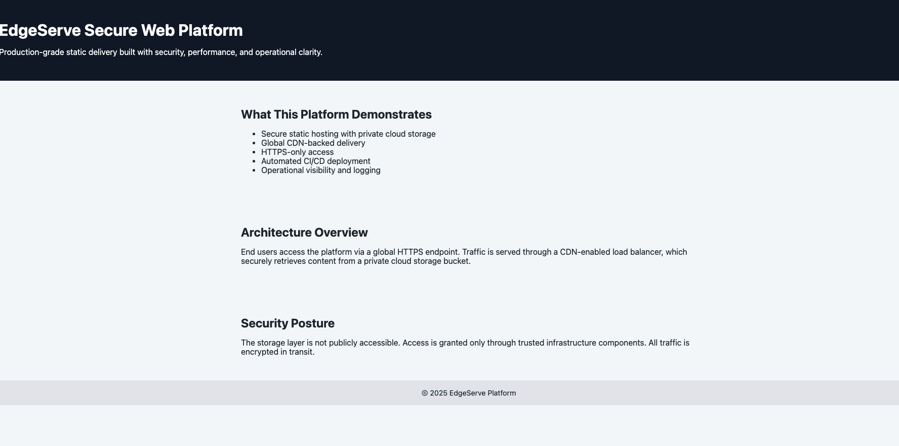

# EdgeServe Secure Web Platform

**Production-grade static delivery built with security, performance, and operational clarity.**

## What This Platform Demonstrates
- Secure static hosting with private cloud storage
- HTTPS-only access
- Automated CI/CD deployment via GitHub Actions
- Operational visibility and logging
- Versioned object storage for safe rollback

## Architecture Overview
Users → HTTPS GCS URL → Private GCS Bucket
│
└─ Logging & Monitoring

- Users access content via HTTPS endpoint.
- GCS bucket is private; only accessible via IAM roles.
- Error pages served via `error.html`.
- Versioning enabled on bucket for safe rollback.
- Conceptually ready for CDN and Load Balancer integration.

## Security Posture
- Bucket is private; access granted via IAM only.
- All traffic encrypted in transit (HTTPS).
- Versioning enabled for all objects.
- Deployment uses a service account with minimal permissions.
- Secrets stored securely in GitHub Actions (`GCP_SA_KEY` & `GCP_PROJECT_ID`).

## CI/CD Deployment
- GitHub Actions workflow deploys `site/` folder to GCS.
- Automatic sync triggered on push to `main` branch.
- Deployment verified by listing bucket contents.
- Optional: notifications on failure.

## Global Scalability & CDN
- Platform is ready for integration with Cloud CDN and HTTPS Load Balancer.
- CDN caches static content at edge locations to reduce latency worldwide.
- Load Balancer ensures high availability and failover.
- GCS bucket remains private; content served securely.

## Operational Observability
- GCS access logs enabled for auditing.
- Versioned objects allow rollback to previous state.
- Optional: Cloud Monitoring dashboards for latency/error tracking.

## Quick Demo

URL: `https://storage.googleapis.com/edge-serve-secure-web-prod/index.html`

## Next Steps / Enhancements
- Enable Cloud CDN with HTTPS.
- Add Monitoring Dashboards (Cloud Monitoring or Grafana).
- Optional: Add a custom domain with HTTPS.
